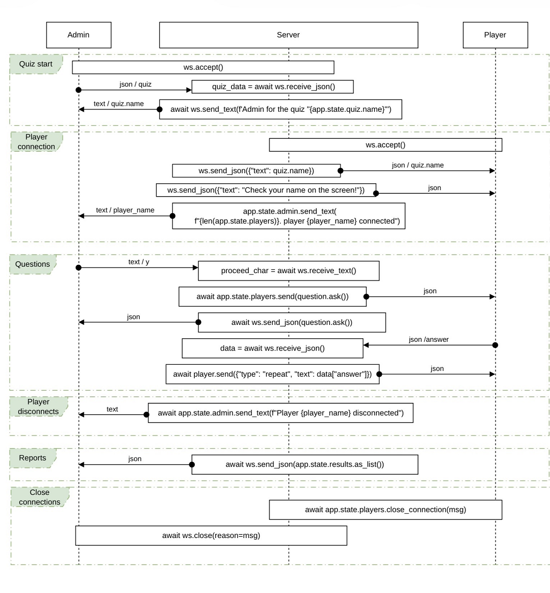

# Desátý sraz

2026-04-16

**Lektor:**  
Martin Zelený

**Zápis:**  
Dagmar Vodáková

---  

Na desátém srazu jsme se věnovali hlavně úpravám komunikace mezi klientem a serverem a také novému repozitáři pro automatické testování.  
Po technické části jsme se přesunuli na Nepyvo do Hostince Pod Schody, kde jsme si vyslechli několik zajímavých přednášek zaměřených na AI.

---

## Issue #4 Response sanitization

Hlavním tématem bylo [Issue #4 Response sanitization](https://github.com/quiz-cli/quiz-client/issues/4) v repozitáři [quiz-client](https://github.com/quiz-cli/quiz-client) od Niny. Prošli jsme Martinovy návrhy a odsouhlasili si směr, kterým se chceme vydat.

Jedním z klíčových bodů bylo sjednocení formátu zpráv posílaných mezi klientem a serverem. Padl návrh vytvořit novou Pydantic modelovou třídu `Message`, která by zajistila jednotnou strukturu JSON zpráv napříč aplikací.

Řešili jsme také podobu odpovědí na straně klienta. Nově budou odpovědi reprezentované jako seznam boolean hodnot – tedy jakási „tlačítka“. Výchozí stav je čtyřikrát `false`, například odpověď "ac" může vypadat takto: `[true, false, true, false]`.

### Komunikační diagram



### Novinka v Pythonu: match + case

Zastavili jsme se i u části kódu, kde se objevila novější konstrukce v Pythonu – `match + case`. Vysvětlili jsme si, jak funguje a jak ji používat jako přehlednější alternativu k `if / elif / else`.

Ukázka z kódu:  

```
match message.get("type"):
    case "question":
        print_question(message)
    case "repeat":
        print(f"You answered: {message['text']}")
    case _:
        print(message["text"])
```

Princip fungování je jednoduchý: výraz za `match` se vyhodnotí (v tomto případě `message.get("type")`) a následně se postupně porovnává s jednotlivými `case` větvemi. Jakmile se najde první shoda, provede se odpovídající blok kódu a další větve se už nevyhodnocují. Speciální zápis `case _:` funguje jako „výchozí větev“ (podobně jako `else`), tedy zachytí všechny ostatní případy.

Výhodou oproti klasickému `if / elif / else` je přehlednost – zejména ve chvíli, kdy větví podle jedné konkrétní hodnoty (např. typu zprávy). Kód je pak čitelnější a lépe škálovatelný při přidávání dalších typů zpráv.

---

## Nové repo: quiz-tests

Další část srazu patřila novému repozitáři [quiz-tests](https://github.com/quiz-cli/quiz-tests), který slouží pro automatické testování kvízového serveru.

Repozitář zatím obsahuje testy a scénáře vygenerované pomocí AI. Jde ale o hrubý návrh, který bude potřeba důkladně projít – některé části upravit, jiné smazat a doplnit nové.

### Struktura projektu

Repozitář se skládá ze dvou hlavních částí: `framework/` a `tests/`.

#### framework/  

Obsahuje jednoduchý testovací framework:  

`app.py` – připravuje FastAPI aplikaci a před každým testem resetuje její stav  
`runner.py` – načítá test.yaml a krok po kroku přehrává scénář  
`actors.py` – reprezentuje účastníky (admin, hráč) a řeší jejich komunikaci přes websocket  
`assertions.py` – obsahuje pomocné kontroly pro ověřování odpovědí serveru  
`models.py` – datové modely pro validaci YAML struktury testů  

#### tests/   

Obsahuje konkrétní testovací scénáře. Každá složka představuje jeden test:  

`basic_flow/` – běžný průchod kvízem s jedním hráčem  
`connect_before_quiz/` – připojení hráče před startem  
`duplicate_answer/` – ověření, že druhá odpověď na stejnou otázku je ignorována  
`no_players/` – průchod bez hráčů  
`player_disconnect/` – odpojení hráče během hry  
`two_players_answer/` – odpovídání dvou hráčů  

Každý test typicky obsahuje: 

`test.yaml` – definici scénáře a jednotlivých kroků  
`quiz.yaml` – vstupní data kvízu (pokud nejsou přímo v `test.yaml`)  
