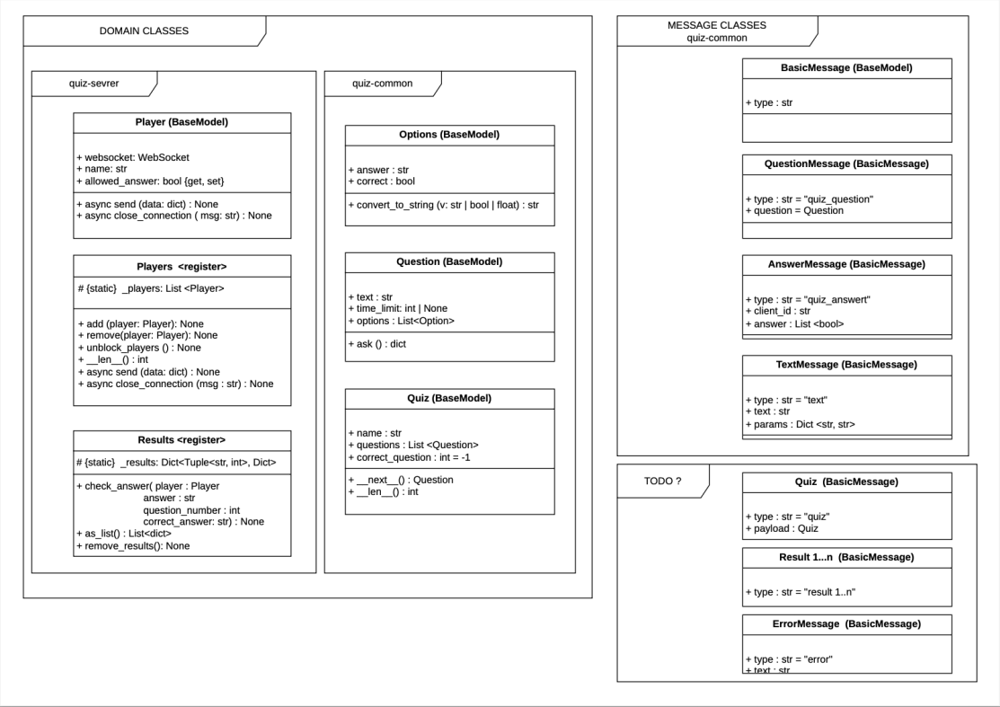
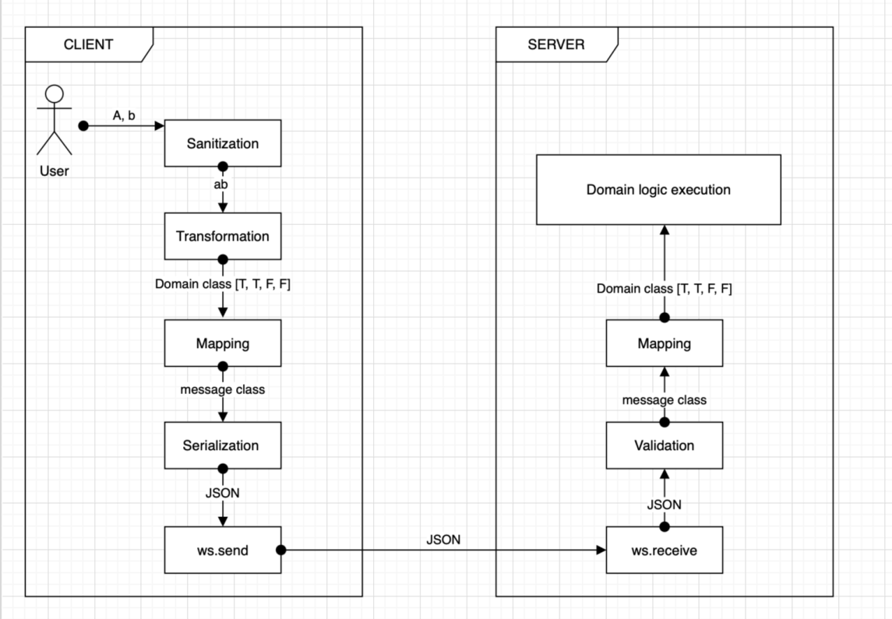

# Třináctý sraz

**Datum:** 2026-05-21  
**Lektor:** David Slavíček  
**Zápis:** Dragča Kvasničková

---

Na dnešním srazu jsme prošli otevřené PR, na kterých pracují Janča a Olga. Prošli jsme Issue v `New/Idea` a pak jsme se přesunuli do hostince Pod schody na Nepyvo s tématem "Webdesign a vývoj pod taktovkou AI".

---

David prošel tabulku projektu a z `New/Idea` se do `Todo` posunuly Issues: [Handle duplicate player names #16](https://github.com/quiz-cli/quiz-server/issues/16) a [Feature: Prevent player from sending answers when no question is active #7](https://github.com/quiz-cli/quiz-client/issues/7)

---

### [refactor: added print_question method #7](https://github.com/quiz-cli/quiz-common/pull/7)

- toto issue řeší Janča
- **Cíl:** Chceme mít jednotnou funkci v `quiz-common`, kterou zavolá server ve chvíli, kdy potřebuje vzít otázku a poslat ji hráči (klientovi) přes síť.
- Janča chtěla zkonzultovat postup, jak vyřešit fakt, aby se správná odpověď nezobrazovala uživateli.
- Janča navrhuje v metodě `ask()` vzít možnosti `(class Option)` a jejich atribut `correct` natvrdo nastavit na `False`. Klient tak dostane kompletní data, která potřebuje pro vykreslení, ale uživatel z nich správnou odpověď nezjistí.

## New pydantic model class called Message

Co řeší Janča ve svém PR, úzce souvisí s issue, které současně řeší Olga: [New pydantic model class called Message #4](https://github.com/quiz-cli/quiz-common/issues/4).

Olga v tomto issue významně mění architekturu projektu a pro lepší pochopení nové struktury k tomu vytvořila i skvělé diagramy, které nám vysvětlila:

### Diagram 1: MESSAGE CLASSES a DOMAIN CLASSES

Tento diagram znázorňuje celkovou strukturu projektu, kterou Olga pro přehlednost rozdělila na dvě samostatné kategorie:

### 1. kategorie : DOMAIN CLASSES (Vlevo)

To jsou třídy, které drží skutečnou logiku hry a kompletní data.

- Patří sem `Quiz`, `Question` a `Options` (z quiz-common) a `Player` (z quiz-server).

- **Důležitý detail:** Třída Question v sobě obsahuje Options, a každá option má v sobě schované políčko `correct: bool`. To znamená, že Domain třídy znají správnou odpověď.

### 2. kategorie: MESSAGE CLASSES (Vpravo)

To jsou „přepravní obálky“ (zprávy), které slouží výhradně k posílání dat po síti.

- Všechny dědí z BasicMessage.
- Patří sem `QuestionMessage`, `AnswerMessage`, `TextMessage` atd.
- Tyto zprávy jsou navržené tak, aby byly bezpečné a obsahovaly jen to, co daná strana (třeba klient) smí vidět.

---

### Diagram 2: Cesta zprávy od uživatele na server:

Tady Olga skvěle znázornila, co se stane, když hráč (User) klikne na odpověď, a jak se data postupně proměňují z kliknutí až po zpracování na serveru.

- **User:** Uživatel klikne na odpovědi (např. zadá možnosti A, b).
- **Client Sanitization:** Klient text vyčistí, transformuje a vytvoří z něj vnitřní objekt hry (Domain class, např. `[True, True, False, False]`).
- **MAPPING (Klíčový krok):** Klient vezme tento vnitřní objekt a „přelije“ (namapuje) ho do přepravní obálky – message class (v tomto případě `AnswerMessage`).
- **SERIALIZATION:** Pydantic vezme tuto message class a zabalí ji do textového formátu JSON.
- **SÍŤ (ws.send -> ws.receive):** Tento čistý JSON text proletí internetem přes WebSockets od klienta k serveru.
- **VALIDATION:** Server přijme JSON a Pydantic okamžitě zkontroluje, zda je zpráva v pořádku a odpovídá schématu příslušné message class.
- **MAPPING zpět:** Server z validované zprávy vytvoří svůj vnitřní objekt (Domain class) a předá ho herní logice (Domain logic execution), která zkontroluje, zda hráč odpověděl správně.

> **Poznámka:** Přesně tento stejný proces (jen v opačném směru – ze serveru ke klientovi) se bude dít s otázkou. Server vezme `Question` (Domain), namapuje ji na `QuestionMessage` (Message), čímž odřízne správné odpovědi, serializuje do JSONu a pošle přes `ws.send` hráči.

### Po implementaci tohoto issue budou v `quiz-common` dvě třídy, které nějakým způsobem reprezentují otázku - `Question` a `QuestionMessage`

### Třída Question
- Třída reprezentuje otázku tak, jak je uložená v databázi nebo v YAML souboru. Obsahuje úplně všechna data, včetně správných odpovědí.
- Pracuje s ní pouze backend `(quiz-server)` a administrátorské rozhraní `(quiz-admin)`.
- Dědí z třídy `QuestionMessage` a rozšiřuje ji o atributy pro validaci a určení správné odpovědi.

### Třída QuestionMessage
- Slouží pouze pro komunikaci mezi `quiz-server` a `quiz-client`.
- Je to zpráva, kterou server posílá hráči do jeho příkazové řádky ve chvíli, kdy to odklikne admin.
- Je to otázka, která se zobrazí hráči bez správných odpovědí, obsahuje jen atributy: `question_id`, `text` a `options`.

---

## Pointa na závěr

- **Obě holky (Jana i Olga) směřují ke stejnému cíli:** Chceme bezpečně a čistě přenášet data mezi serverem a klientem, aniž by hráč mohl v síťové komunikaci vidět správné odpovědi.

- **Jančino řešení (PR #7)** je rychlý, okamžitě funkční krok. Vyřeší aktuální bezpečnostní mezeru tím, že data pro klienta prozatím v metodě `ask()` ručně upraví a přepíše hodnotu `correct` na `False`.

- **Olžino issue (#4)** představuje velký, architektonický úkol pro celý projekt. Jakmile bude její komplexní systém tříd `Message` plně implementován, Jančino prozatímní řešení zanikne. Nová architektura ho plně nahradí čistým, automatickým ořezáváním dat přímo přes Pydantic.

